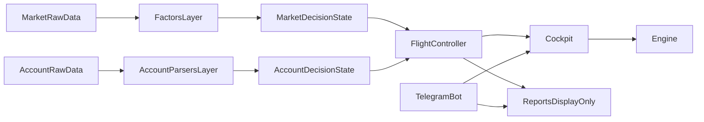
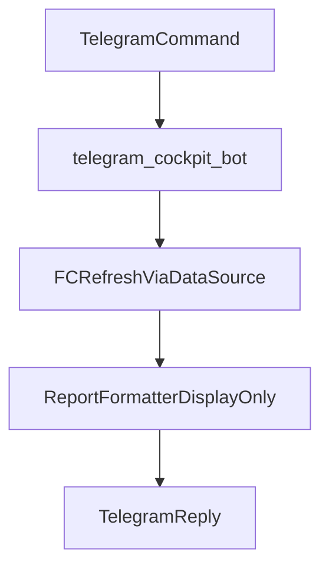
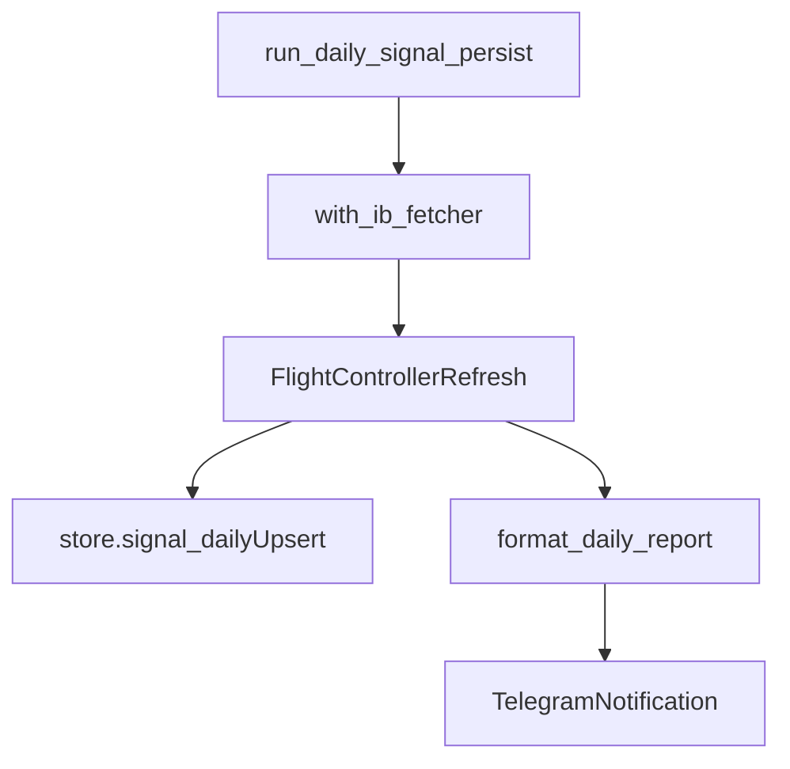
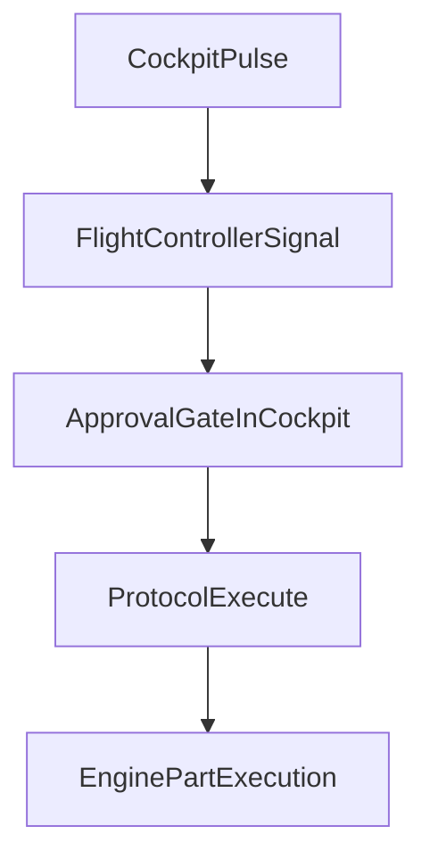

# 注文処理とプロトコル階層（アーキテクチャ）

定義書「4-1 操縦制御」「6-2 Emergencyプロトコル」および執行原則を、コードの責務分離として整理した文書。

---

## 1. 注文処理の「どこで」：2段階の分離

| 段階 | 役割 | 担当 | 内容 |
|------|------|------|------|
| **物理的な発注** | 執行 (Execution) | Engine / Part | limit_order() や placeOrder()（ib_async）を叩く。各 Part が get_target_delta() で計算し、OrderManager（ib_async ラッパー）で発注する。 |
| **発注のシーケンス制御** | 作戦 (Scenario) | Cockpit / Protocol | 「どの順番で、どのエンジンを動かすか」を決定。Emergency など銘柄を跨ぐ順序制御は個別 Engine には判断できないため、ここで行う。 |

- **注文を「書く」**: Engine 配下の Part（PB/CC/BPS）。
- **注文を「並べる」**: Cockpit 配下の Protocol クラス。

---

## 2. 注文処理の階層構造（司令から発注まで）

| 階層 | 役割 | 処理内容 |
|------|------|----------|
| **Cockpit** | 司令 (Command) | `FlightController` の signal を受け、モード遷移・承認ゲートを経て対応するプロトコルを起動する。 |
| **FlightController** | 判断 (Judgment) | 市場/口座の判定済み state を集約し、`FlightControllerSignal` を返す。 |
| **Protocol**（EmergencyProtocol 等） | 作戦 (Scenario) | 「ステップ1: 先物削減」「ステップ2: …」と Engine に順番に命令を出す。 |
| **Engine / Part** | 執行 (Execution) | 命令を受け、ib_async で市場に注文を送る。 |

---

## 3. プロトコル階層の再定義

Emergency だけを特別扱いせず、モード遷移に伴う一連の行動を「プロトコル」として共通の階層に置く。

Cockpit の直下に、以下の 4 プロトコルを配置する。

| プロトコル名 | 役割・ニュアンス | 執行の性格 |
|--------------|------------------|------------|
| **BoosterIgnition** | 余剰証拠金を確認し、BPS 等の「加速装置」に点火する。 | 能動的・攻勢 |
| **BoosterCutoff** | 加速を停止し、リスクを切り離して通常巡航に戻る。 | 制御・減速 |
| **Emergency** | 即時パニック停止。最優先の防衛シーケンス。定義書 6-2。 | 即時・強制 |
| **Restoration** | 異常事態から通常（Level 0/1）へ復旧する手順。 | 慎重・再構築 |

- 定義書の**執行原則**（ギアダウン時: 先物削減→ブースターBPS削減→メインエンジンPB転換の順）は、単一 Engine では完結せず、**ポートフォリオ全体の順序制御**である。そのため Engine 内部ではなく Protocol 階層で記述する。
- Engine は「言われた時に、言われたパーツを動かす」コンポーネントに徹し、FlightController は「どのモード/レベルかの判断」に専念し、Cockpit が「どのプロトコルを選ぶか」を担う。

---

## 4. BaseProtocol：共通の枠組みと安全装置

基底クラスが持つのは**「個別の執行ロジック」ではなく「執行の安全装置と共通の作法」**。

### 4.1 基底クラスの主な役割

1. **共通の事前・事後チェック (Guard & Clean-up)**
   - **Pre-run Simulation**: 実行直前に「今の証拠金でこの注文を出しても大丈夫か？」を各 Engine に計算させる。
   - **Post-run Validation**: 執行後、目標デルタや証拠金状態に正しく着地したかを検証する。

2. **タイムアウトとリトライの制御 (Execution Control)**
   - **Step Timeout**: 1 つの注文が一定時間内に約定しなかった場合の共通ハンドリング。
   - **Atomic Transaction**: 一連のステップが途中で失敗した場合のフラグ管理。

3. **共通のロギング・通知**
   - 「ステップ 1/9 完了: NQ先物 5枚決済済」などを Telegram／内部ログへ標準フォーマットで出力。

### 4.2 抽象メソッド（子クラスが実装）

- `async def run(self, engines)`: プロトコルのメインシーケンス。
- `def get_priority(self)`: 複数プロトコルが衝突しそうな場合の優先度。

### 4.3 実行フロー

```
execute(engines):
  1. 事前シミュレーション (validate_margin 等)
  2. run(engines)  # 子クラスのシーケンス
  3. 事後確認 (report_completion)
```

---

## 5. Docker 化と ib_async 接続（Phase 4 留意点）

- **接続の共通化**: IB クライアント（ib_async.IB()）は OS 全体のトップレベルで 1 つ保持し、各 Engine に DI する。
- **非同期の待機**: 「約定 (Fill) を待つか、注文送信 (Placed) だけで次に進むか」を、プロトコルのステップごとに定義する（定義書「裸売り時間をゼロにする」のため）。

---

## 6. レイヤー責務（Cockpit / FlightController / Engine / Reports / Telegram）

実装の判断ブレを防ぐため、責務を以下に固定する。

| レイヤー | 主責務 | やってよいこと | やってはいけないこと |
|----------|--------|----------------|----------------------|
| **Cockpit** | オーケストレーション | `FlightController` の判断結果を受け、モード配布・プロトコル実行順制御・承認ゲートを管理する | 市場/口座データの解釈ロジックを持つこと |
| **FlightController** | 判断の集約 | market/account の判定済み state を束ね、最終の signal を返す | 発注や Telegram I/O の直接実装 |
| **Engine / Part** | 執行 | target delta 計算と発注実行 | 司令層の承認フローや表示整形 |
| **Reports** | 表示整形 | 判定済みデータをテキスト化・テンプレート描画 | 判定ロジック（ON/OFF 判定、strategy 判定など） |
| **Telegram Bot** | I/O アダプタ | コマンド受付、返信、アプリ層呼び出し | ドメイン判定・SQL 直接操作 |

---

## 7. 市場データと口座データの対称アーキテクチャ

`factors` と `account_parsers` は対になる層であり、どちらも「生データを意味状態に変換する」責務を持つ。

- **市場データ系**
  - Raw market data -> `factors` -> factor/signal state
- **口座データ系**
  - Raw account data -> `account_parsers` -> actual/strategy state
- **共通ルール**
  - 解釈・判定は parser/factor で行い、report は表示のみを担当する



---

## 8. IB API 局所化ポリシー

IB API（`ib_async` / `ib_insync`）呼び出しは `avionics/ib` に局所化する。

- **許可**
  - `src/avionics/ib/*` での接続・取得処理
  - エントリポイント（scripts）から `with_ib_fetcher` 等を介した利用
- **禁止**
  - `cockpit` / `reports` / `store` / `notifications` からの IB クライアント直接呼び出し
- **データ受け渡し**
  - 他レイヤーは `DataSource` / `FlightController` 経由でのみ利用する

---

## 9. DB アクセス許可レイヤー

SQLite を含む永続化アクセスは `store` を境界に管理する。

- **許可**
  - SQL/接続管理は `src/store/*` に集約
  - `scripts` / `cockpit` は `store` API 呼び出しまで
- **禁止**
  - `reports` / `factors` / `account_parsers` における SQL 直接実行
  - Telegram 層での SQL 直接実行

### 9.1 as-is / to-be（移行メモ）

- **as-is（現状）**
  - `cockpit` は `store` API を呼び出して state/mode を読み書きする。
  - 一部コンポーネントで `sqlite3.Connection` を受け取るが、SQL文は `store` 側へ集約する方針。
- **to-be（目標）**
  - 永続化の実処理（SQL/トランザクション）は `store` のみが保持する。
  - `cockpit` / `scripts` / `telegram` は `store` API のみを利用し、SQLの知識を持たない。
- **暫定例外の扱い**
  - 層境界を跨ぐ暫定実装は、TODO に「理由・戻し先・期限」を明記する。

---

## 10. Reports と Telegram の接続ルール

### 10.1 Reports
- formatter は「判定済み state -> 表示テキスト」変換のみ。
- ON/OFF 判定や strategy 判定は `account_parsers` / `factors` 側で確定させる。

### 10.2 Telegram
- Telegram は I/O 境界として、以下のみ担当する。
  - command routing
  - 返信送信
  - アプリ層（Cockpit / report builder）呼び出し
- Telegram 層でドメイン判定を追加しない。

---

## 11. Allowed Dependencies（許可依存 / 禁止依存）

| レイヤー | 許可依存 | 禁止依存 |
|----------|----------|----------|
| `avionics/ib` | ib クライアント、market/account 取得 | `reports` / `notifications` への逆依存 |
| `factors` | avionics data model | `store` / Telegram / SQL |
| `account_parsers` | avionics data model | `store` / Telegram / SQL |
| `flight_controller` | factors、account_parsers、DataSource | IBクライアント直接呼び出し |
| `cockpit` | flight_controller、engine、protocols、store API | report整形ロジック、SQL直書き |
| `reports` | 判定済み state、template renderer | ib API、SQL、ドメイン判定 |
| `telegram` | cockpit/report 呼び出し、通知I/O | ドメイン判定、SQL直書き、ib API直接呼び出し |

---

## 12. 主要実行フロー（Telegram / Batch / Auto）







---

## 13. 運用ガードレール（逸脱防止）

1. **判定ロジック追加時の配置規則**
   - 市場由来判定 -> `factors`
   - 口座由来判定 -> `account_parsers`
2. **一時的な逸脱テンプレ**
   - 緊急修正で層を跨ぐ場合は、TODO に以下を明記する。
     - 理由（なぜ今ここで必要か）
     - 戻し先（本来置くべきレイヤー/関数）
     - 期限（いつまでに戻すか）
3. **PRレビュー観点**
   - report に解釈ロジックが入っていないか
   - IB API が `avionics/ib` 以外で直接呼ばれていないか
   - SQL が `store` 境界を越えていないか

---

## 14. FC.refresh データフロー詳細（API呼び出し境界）

この章は `FlightController.refresh()` の実行境界を明確化するための補足であり、Layer 境界の判断基準として扱う。

### 14.1 どこで API が呼ばれるか

- `fc.refresh(data_source, as_of, symbols, ...)` は内部で `data_source.fetch_raw(...)` を呼ぶ。
- 実際の API 呼び出し（`reqHistoricalDataAsync` 等）は `avionics/ib/fetcher.py` 側で実行される。
- `fc.apply_all(...)` は API を呼ばない。渡された `SignalBundle` を因子へ配布するだけ。

### 14.2 refresh の処理順

1. `data_source.fetch_raw(...)` で Raw 取得
2. `build_signal_bundle(...)` で Layer2 signal を構築
3. `_update_all_from_signals(...)` で因子へ配布
4. `get_flight_controller_signal()` で ICL/SCL/LCL を計算

### 14.3 実装上の接続原則

- エントリポイント（scripts / bot）は `with_ib_fetcher` 等で DataSource を得て `fc.refresh(...)` に注入する。
- `Cockpit` / `Reports` は IB API を直接呼ばず、`FlightController` または formatter API 経由で状態を参照する。

---

## 15. 正本ドキュメントの扱い

- アーキテクチャの正本（single source of truth）はこの `ARCHITECTURE.md` とする。
- `DATA_FLOW_API_TO_FC.md` は補助資料（詳細解説）として扱い、規範ルールは本書を優先する。

---

## 16. 因子レベルの寿命と Telegram 経路

- **因子インスタンスの寿命**: `BaseFactor` は常に `level = levels[0]` で生成される（[base_factor.py](../../src/avionics/factors/base_factor.py)）。`FlightController` を新規に組み立てるたびに因子状態はリセットされる。
- **Telegram ボット**: `scripts/telegram_cockpit_bot.py` の `_refreshed_fc` がコマンド（`/cockpit` 等）ごとに `build_cockpit_stack` してから `fc.refresh` を 1 回実行する。そのため **プロセス再起動なしでも、コマンド単位で因子は毎回クールドスタート**に近い挙動になる。
- **DB の役割**: `store/signal_daily` は日次シグナルログ用であり、**因子レベルの入力シードには使わない**方針とする。レベル整合は **バンドルに載る履歴・Layer 2 からの再算出**で担保する（経路・リスクの網羅は [FACTOR_LEVEL_RESET_AUDIT.md](FACTOR_LEVEL_RESET_AUDIT.md)）。
